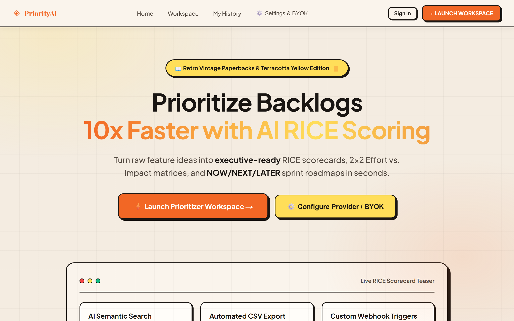
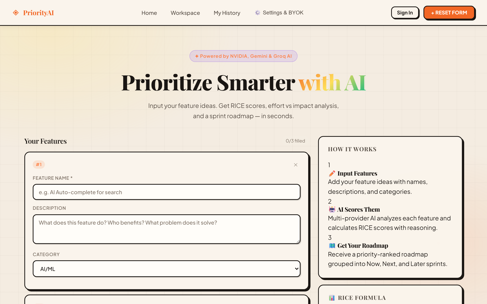
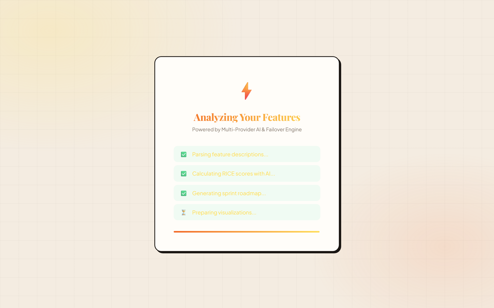
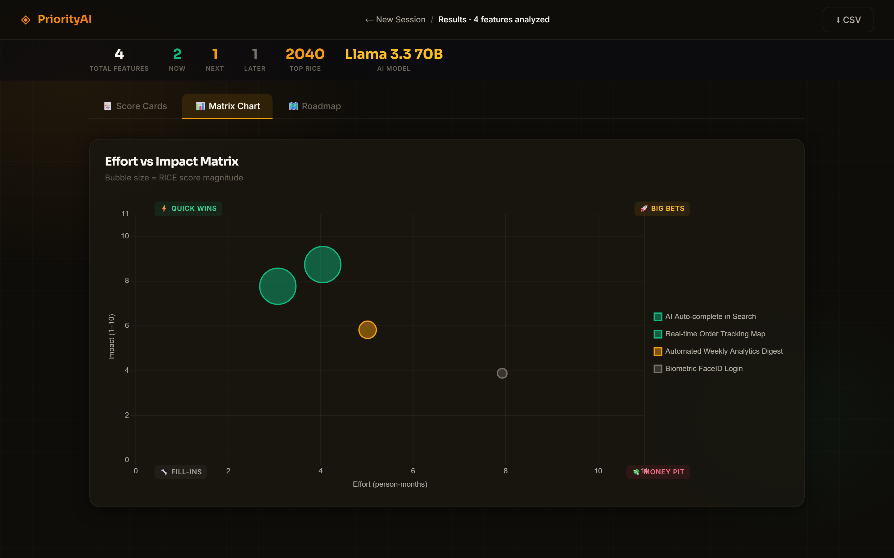
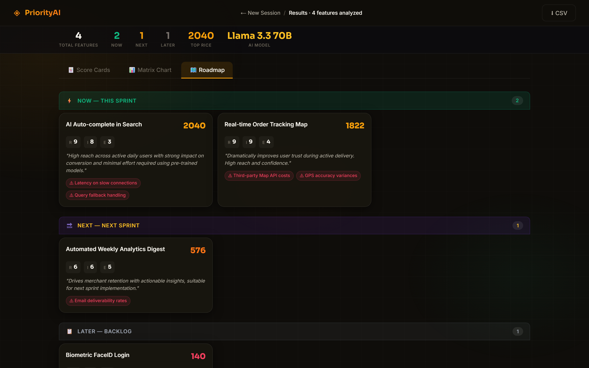

# PriorityAI — AI Feature Prioritization Dashboard & App 🚀

> **The easiest AI tool for Product Managers and Founders to rank feature ideas in 5 seconds.** 
> Get RICE scores, effort vs. impact charts, and sprint roadmaps automatically — zero coding required!

[](https://01-feature-prioritizer.vercel.app)


🌐 **Try Live in Your Browser:** [https://01-feature-prioritizer.vercel.app](https://01-feature-prioritizer.vercel.app)

---

## 📸 Visual Tour & Screenshots (Retro Vintage Paperback Edition)

### 🎯 1. SaaS Landing Home Page
High-converting home page with live RICE scorecard teasers and feature grid.


### ⚡ 2. Prioritizer Workspace (`/analyze`)
Enter feature names, descriptions, and categories to run AI RICE scoring.


### 🃏 3. AI RICE Score Cards & Results
Multi-provider AI scores each feature on Reach, Impact, Confidence, and Effort with LLM reasoning.


### 📊 4. Interactive Effort vs. Impact 2×2 Matrix
Visual Effort vs Impact bubble plot categorizing features across high-impact quadrants instantly.


### 🗺️ 5. NOW / NEXT / LATER Sprint Roadmap
Organized sprint swim lanes ready for 1-click export to Jira, Linear, or Notion.


---

## 🌟 What This Tool Does For You (In Simple Words)

- ⚡ **Calculates RICE Scores Automatically:** No spreadsheets or manual math needed.
- 🔒 **Save Your Work:** Sign in with Google or Email to save past prioritizations.
- 📱 **Install on Phone or PC:** Click **"📱 Install App"** to add it to your home screen like a native phone app.
- 🔑 **Bring Your Own Key (BYOK):** Use your own free Google Gemini key or server-provided AI.
- ⬇️ **1-Click Export:** Download your prioritized roadmap as a CSV file.

---

## 🐣 Beginner's 3-Step Installation Guide (No Tech Knowledge Needed!)

Want to run this app locally on your own computer? Follow these 3 simple steps:

### Step 1: Install Node.js (If you don't have it)
Download and install the free **Node.js** installer from [nodejs.org](https://nodejs.org). Just click "Next" through the installer.

### Step 2: Open your Terminal / Command Prompt and Run 3 Commands
Open **Command Prompt** (on Windows) or **Terminal** (on Mac), paste these 3 lines one by one, and press **Enter**:

```bash
# 1. Download the project files
git clone https://github.com/26BB/ai-feature-prioritizer.git

# 2. Go into the project folder
cd ai-feature-prioritizer

# 3. Install the app packages
npm install
```

### Step 3: Start the App!
Run this final command:

```bash
npm run dev
```

🎉 **That's it!** Now open your internet browser (Chrome, Edge, or Safari) and go to:
👉 **`http://localhost:3000`**

---

## 📱 How to Install as an App on Your Mobile Phone or Laptop

1. Open [https://01-feature-prioritizer.vercel.app](https://01-feature-prioritizer.vercel.app) in Google Chrome or Edge.
2. Look for the floating **"📱 Install App"** banner at the bottom.
3. Click **Install**. The app will now sit on your home screen or desktop like a regular app!

---

## 🔑 How to Get a Free AI Key (BYOK)

1. Click **⚙️ Settings & BYOK** in the app menu.
2. Choose **Google Gemini**.
3. Get a free key from [Google AI Studio](https://aistudio.google.com) and paste it into the settings box.
4. Click **Save Preferences**!

---

## 📄 License

Free & Open Source under the MIT License © [Bhushan Bhosale](https://github.com/26BB)
