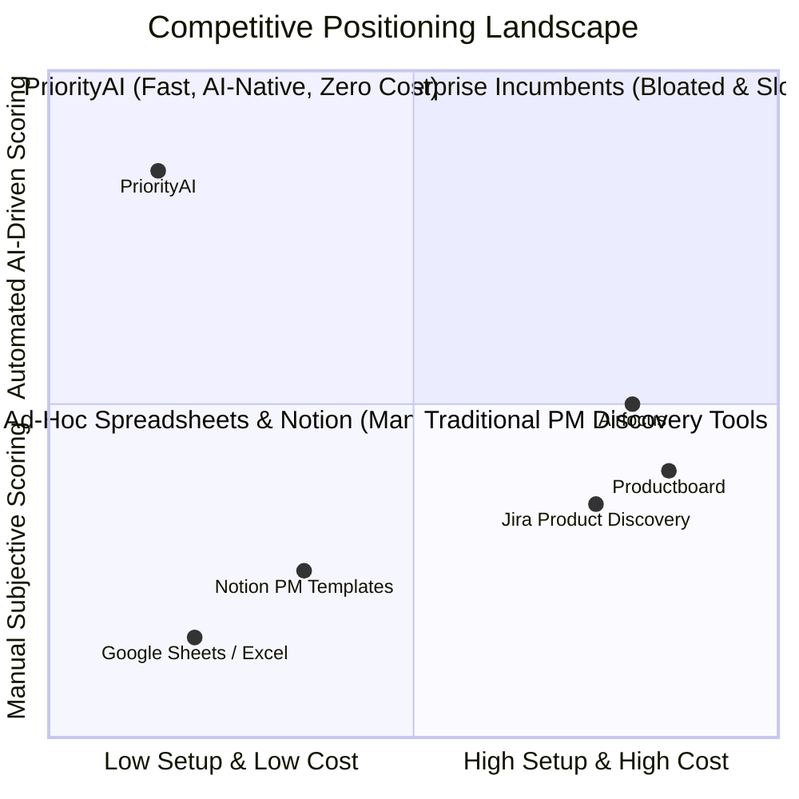
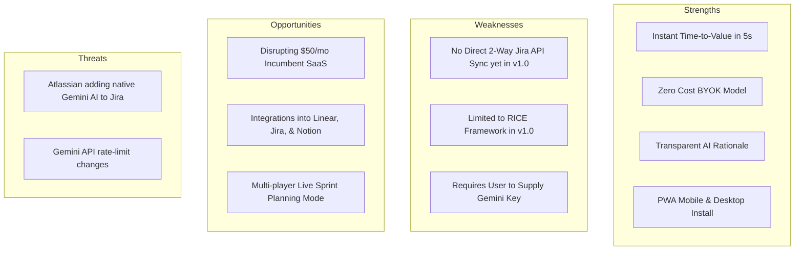

# Competitive Landscape & Positioning Analysis — PriorityAI ⚔️

> **Product:** PriorityAI (AI Feature Prioritization Dashboard)  
> **Author:** Bhushan Bhosale (Lead Product Manager)  
> **Market Category:** Product Discovery, Roadmapping & Decision-Intelligence  
> **Last Updated:** August 2026  

---

## 1. Market Overview & Competitive Landscape

The product management software market is dominated by heavy enterprise suites designed for large corporations with established product ops teams. However, the explosion of early-stage startups and solo PMs has created a massive underserved gap for **instant, frictionless, AI-native decision tools**.

---

## 2. Competitor Breakdown

### 1. Productboard
* **Target Audience:** Enterprise PM teams (500+ employees).
* **Pricing:** $20 to $80 per maker / month.
* **Strengths:** Deep Salesforce/Zendesk integrations; sophisticated customer feedback aggregation.
* **Weaknesses:** Steep learning curve; takes weeks to configure; expensive for seed startups; lacks real-time generative AI estimation.

### 2. Jira Product Discovery (Atlassian)
* **Target Audience:** Jira-centric engineering organizations.
* **Pricing:** $10 to $35 per user / month.
* **Strengths:** Native sync into Jira software sprints; matrix views.
* **Weaknesses:** Tied into the Atlassian ecosystem; cluttered interface; requires manual scoring inputs for all dimensions.

### 3. Airfocus
* **Target Audience:** Mid-market product leaders.
* **Pricing:** $19 to $69 per editor / month.
* **Strengths:** Multiple prioritization frameworks (RICE, WSJF, Value vs. Effort).
* **Weaknesses:** Expensive seat-based licensing; slow AI adoption; requires formal workspace onboarding.

### 4. Manual Spreadsheets & Notion (The True Incumbent)
* **Target Audience:** Solo PMs, Startup Founders, Indie Hackers.
* **Pricing:** Free / $10/mo.
* **Strengths:** Completely flexible; zero new tool learning curve.
* **Weaknesses:** High manual setup time; formulas break; no automated AI reasoning; visual 2x2 charts are painful to maintain and update.

---

## 3. Feature & Capability Comparison Matrix

| Feature / Dimension | PriorityAI | Productboard | Jira Product Discovery | Airfocus | Google Sheets |
|---|:---:|:---:|:---:|:---:|:---:|
| **Time to First Prioritization** | **< 30 seconds** | ~3–5 days | ~2 hours | ~1 hour | ~45 minutes |
| **Pricing Model** | **100% Free (BYOK)** | $20–$80/seat/mo | $10–$35/seat/mo | $19–$69/seat/mo | Free |
| **AI-Powered RICE Estimation** | ✅ **Automated (Gemini)** | ⚠️ Limited / Beta | ❌ Manual | ⚠️ Basic AI Assist | ❌ Manual |
| **Written AI Rationale for Scores** | ✅ **Yes (Granular)** | ❌ No | ❌ No | ❌ No | ❌ No |
| **Interactive 2x2 Quadrant Matrix** | ✅ **Built-in Live** | ✅ Yes | ✅ Yes | ✅ Yes | ❌ Painful Setup |
| **Now / Next / Later Swimlanes** | ✅ **Instant Auto-Sync** | ✅ Yes | ✅ Yes | ✅ Yes | ⚠️ Manual Columns |
| **PWA (Mobile & Desktop Offline)** | ✅ **Yes** | ❌ No | ❌ No | ❌ No | ⚠️ Mobile App |
| **Zero Account Required (Guest)** | ✅ **Yes** | ❌ No | ❌ No | ❌ No | ⚠️ Requires Google |
| **1-Click CSV / Jira Data Export** | ✅ **Yes** | ✅ Yes | ✅ Native | ✅ Yes | ✅ Yes |

---

## 4. SWOT Analysis — PriorityAI

---

## 5. Strategic Moat & Why PriorityAI Wins

1. **The BYOK Disruption Wedge:** Traditional SaaS has to markup AI inference costs to protect gross margins ($20+/mo). PriorityAI decouples the UI from inference by letting users bring their free Google Gemini API key. This makes PriorityAI **free forever** without burning venture capital.
2. **Speed & Zero-Setup:** Where enterprise tools demand complex workspace hierarchies, PriorityAI requires zero onboarding: enter feature $\rightarrow$ get RICE score in 5 seconds $\rightarrow$ export CSV.
3. **AI Defensibility Rationale:** Incumbent tools rely on subjective user sliders. PriorityAI delivers structured, math-grounded justification for Reach, Impact, Confidence, and Effort, eliminating HiPPO bias in sprint grooming meetings.
