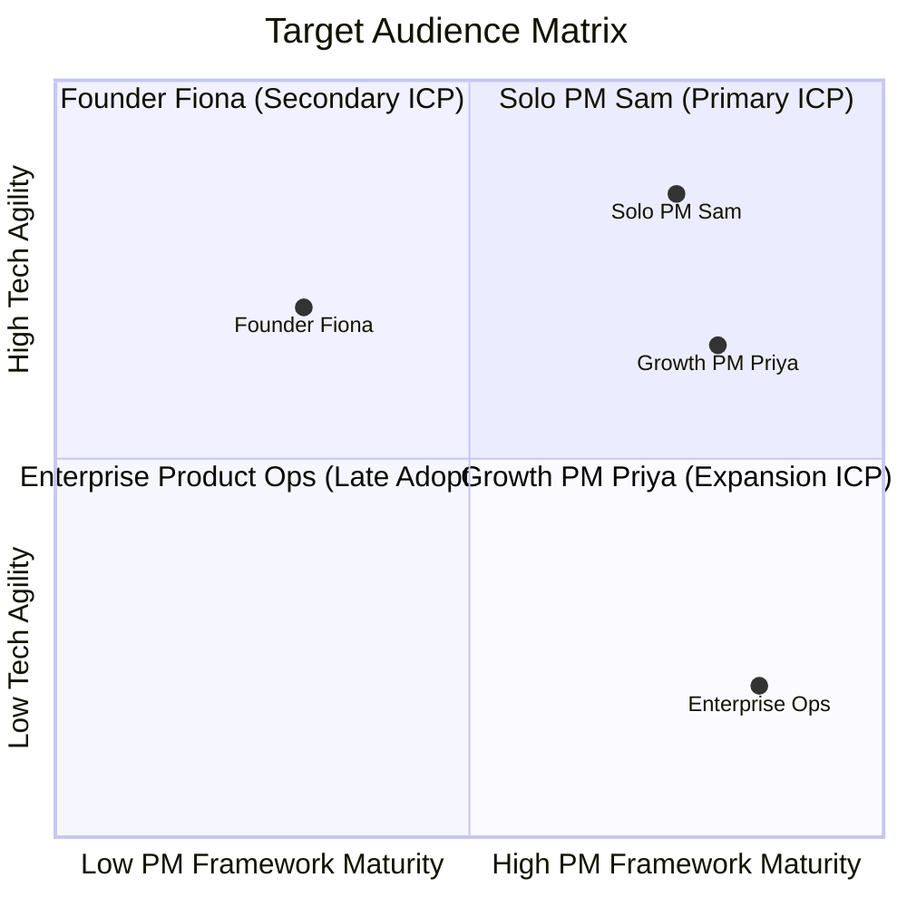
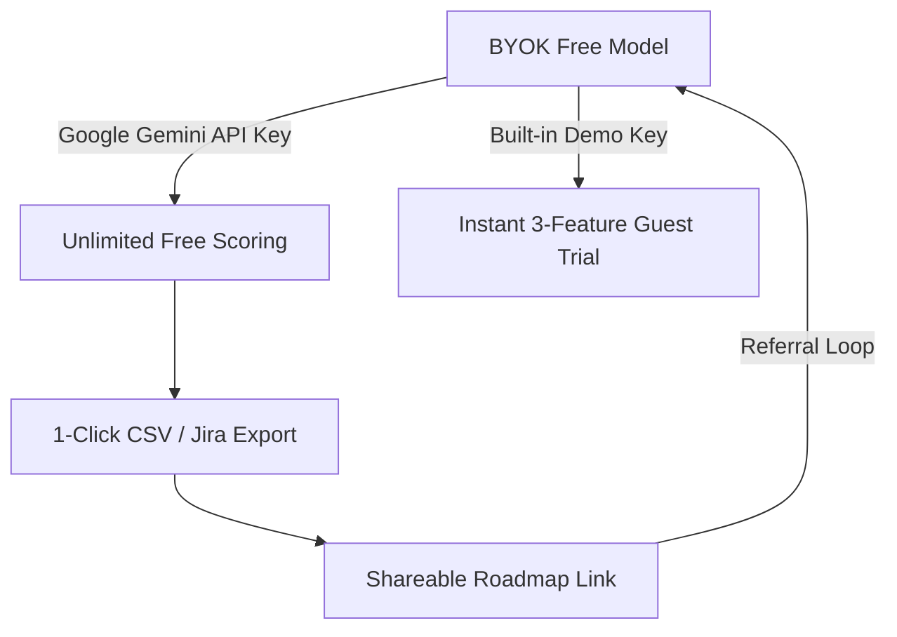
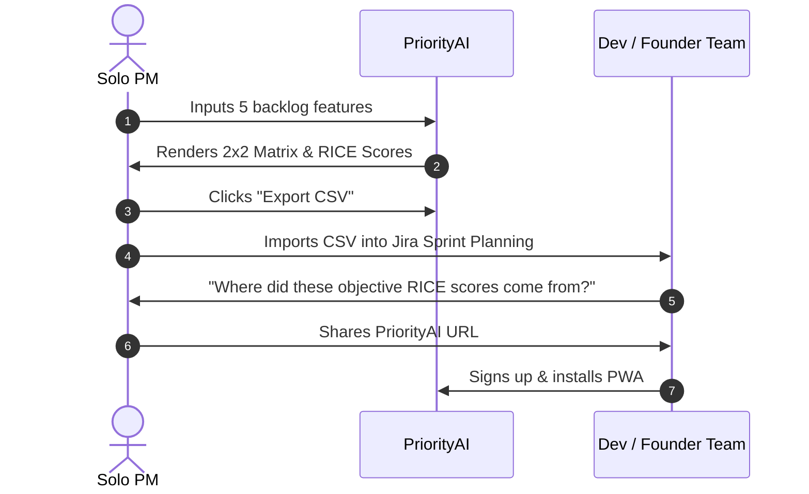

# Go-To-Market (GTM) Strategy — PriorityAI 🚀

> **Product:** PriorityAI (AI-Powered Feature Prioritization Dashboard)  
> **Author:** Bhushan Bhosale (Growth & Product Lead)  
> **Target Audience:** Solo PMs, Startup Founders, Product Squad Leads  
> **Launch Version:** v1.0 General Availability (GA)  
> **Live App:** [01-feature-prioritizer.vercel.app](https://01-feature-prioritizer.vercel.app)  

---

## 1. GTM Objectives & Vision

PriorityAI aims to become the default **instant feature prioritization tool** for early-stage tech teams and solo PMs by removing setup friction and enterprise pricing barriers.

### Strategic Launch Goals (First 90 Days)
* **User Acquisition:** 2,500+ Unique Monthly Active Prioritizers (MAPs).
* **Core Value Metric:** 1,000+ Prioritized Roadmaps exported to CSV/Jira.
* **Conversion to PWA:** 300+ Progressive Web App home-screen installations.
* **Community Footprint:** Top 5 Product of the Day on Product Hunt in the AI / Productivity category.

---

## 2. Ideal Customer Profile (ICP) & Persona Segmentation

### ICP Breakdown:
1. **Tier 1: Solo PMs in Startups (10–50 Employees)**
   * *Trigger Event:* Approaching weekly sprint planning or quarterly roadmap reviews with unstructured backlog ideas.
   * *Value Hook:* "Turn 10 messy feature bullets into an objective RICE roadmap and 2x2 matrix in 5 seconds."
2. **Tier 2: Non-Technical Founders & Indie Hackers**
   * *Trigger Event:* Overwhelmed by feature requests from early beta users; unsure what to build next.
   * *Value Hook:* "AI acts as your virtual VP of Product—identifies Quick Wins and saves engineering budget."
3. **Tier 3: Growth PMs & Squad Leads**
   * *Trigger Event:* Running conversion optimization experiments; needing rapid prioritization of growth ideas.
   * *Value Hook:* "Instant RICE scoring with zero spreadsheet formulas or $50/seat tool overhead."

---

## 3. Positioning & Messaging Matrix

### Core Value Proposition
> *"PriorityAI gives product managers and founders instant, defensible RICE scores, 2x2 Effort vs. Impact charts, and sprint roadmaps with zero spreadsheets and zero subscription fees."*

### Value Pillars & Messaging Angles

| Audience Segment | Pain Point | Positioning Headline | Proof / Hook |
|---|---|---|---|
| **Solo PMs** | 2+ hours wasted building Excel RICE models | *"Kill the Prioritization Spreadsheet."* | AI generates Reach, Impact, Confidence, Effort & rationale in 5s. |
| **Founders** | HiPPO bias and building wrong features | *"Your AI Chief Product Officer on Demand."* | Visual 2x2 matrix isolates Quick Wins from Thankless Tasks. |
| **Engineering Leads** | Arbitrary product backlog requests | *"Prioritization Backed by Objective Logic."* | Every score includes structured AI rationale ready for review. |

---

## 4. Pricing & Distribution Model

### Why "Bring Your Own Key" (BYOK) Wins:
* **Zero Marginal Cost:** The business incurs zero server inference billing; users leverage Google's generous free-tier Gemini API (15 RPM free).
* **Zero Paywall Friction:** Users get unrestricted enterprise-grade AI capabilities without entering a credit card.
* **Instant Trust & Privacy:** API keys remain strictly local in browser storage, meeting privacy compliance for startup IP.

---

## 5. Channel Distribution & Launch Playbook

### Channel 1: Product Hunt Launch Playbook
* **Tagline:** *"AI-Powered Feature Prioritization in 5 Seconds — Zero Spreadsheets."*
* **Launch Assets:**
  * Animated GIF demo showing 1-click RICE generation and 2x2 matrix interaction.
  * Maker Comment telling the origin story (frustration with 2-hour Sunday night spreadsheet prep).
  * First-hour engagement sequence across Twitter/X and PM communities.

### Channel 2: LinkedIn Proof-of-Work Growth Engine
* **Content Series:**
  1. *The HiPPO Killer:* "How I replaced our 2-hour Monday sprint grooming with a 5-minute AI RICE workflow."
  2. *Interactive Case Study:* "Prioritizing 5 real Airbnb feature requests using RICE + 2x2 Matrix (with free template)."
  3. *Building in Public:* Visual walkthroughs of the vintage paperback design and PWA offline architecture.

### Channel 3: Community & Grassroots Seeding
* **Subreddits:** `r/ProductManagement`, `r/startups`, `r/SideProject`, `r/indiehackers`.
* **AI Directories:** Listed on *There's An AI For That*, *Toolify.ai*, *Futurepedia*, and *Product Hunt*.
* **Slack / Discord PM Hubs:** Mind the Product, Lenny's Newsletter Community, Product School Alumni.

---

## 6. Viral Loops & Growth Mechanics

1. **Watermarked CSV Exports:** Exported CSV headers include a clean footer: `Generated via PriorityAI (01-feature-prioritizer.vercel.app)`.
2. **Interactive Showcase Mode:** Pre-loaded with realistic B2B & B2C demo datasets (Food Delivery, E-commerce, SaaS) so visitors experience value in 0 clicks.
3. **PWA Home Screen Prompt:** Prompts users after their 2nd successful export to install the desktop/mobile app for 1-click sprint access.

---

## 7. Launch Execution Timeline & Milestones

| Timeline | Phase | Key Deliverables & Activities | Milestone Target |
|---|---|---|---|
| **Week 1** | **Soft Launch / Alpha** | Internal dogfooding; verify Gemini BYOK reliability on mobile/desktop. | 50 test prioritizations |
| **Week 2** | **Directory Seeding** | Submit to 15+ AI directories; publish initial LinkedIn case study. | 250 unique visitors |
| **Week 3** | **Product Hunt GA** | Live Product Hunt launch day; coordinate morning upvote momentum. | Top 5 Product of Day |
| **Week 4–6** | **Growth Flywheel** | Publish weekly PM teardowns; roll out CSV Jira template mapping. | 1,000+ exports |
| **Week 7–12** | **Expansion (v1.1)** | Beta release of direct Notion & Jira 1-click sync. | 2,500+ MAPs |

---

## 8. GTM Success Metrics & Dashboard

| KPI | Target | Tracking Tool | Action Threshold |
|---|---|---|---|
| **Landing Page Conversion** | $\ge 20\%$ to `/analyze` | Google Analytics 4 | If $<15\%$, revamp hero CTA and demo sandbox. |
| **Analysis-to-Export Rate** | $\ge 25\%$ | PostHog Custom Event | If $<20\%$, refine AI rationale quality and prompt precision. |
| **PWA Install Rate** | $\ge 10\%$ of returning users | Web App Manifest Event | If $<8\%$, adjust install banner timing to post-export moment. |
| **D7 Return Rate** | $\ge 30\%$ | PostHog Retention Cohorts | If $<20\%$, add email reminder for weekly sprint grooming. |
