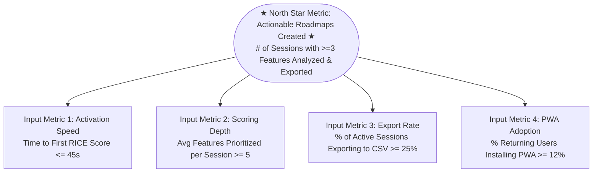
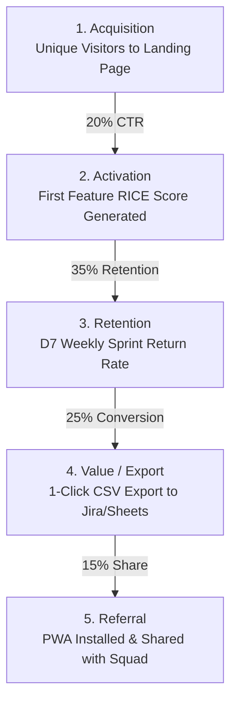
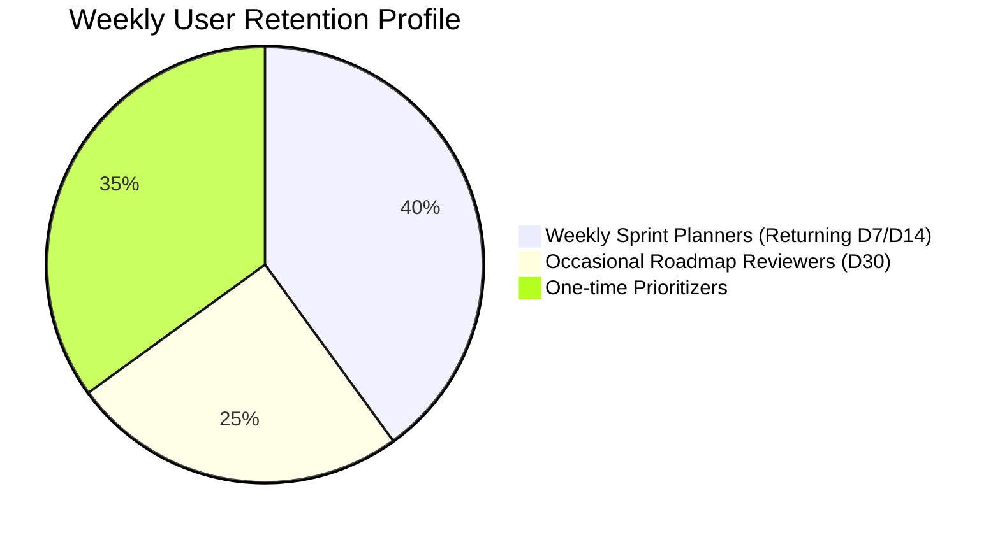

# Product Metrics Framework & Event Tracking Plan — PriorityAI 📊

> **Product:** PriorityAI (AI Feature Prioritization Dashboard)  
> **Author:** Bhushan Bhosale (Lead Product Manager)  
> **Telemetry Stack:** PostHog / Mixpanel / Google Analytics 4  
> **Last Updated:** August 2026  

---

## 1. Product Measurement & North Star Framework

### Metrics Definitions

| Metric Category | Metric Name | Formula / Definition | Target KPI |
|---|---|---|:---:|
| **North Star** | **Actionable Roadmaps Created (ARC)** | Count of sessions with $\ge 3$ features analyzed and exported to CSV/Jira per week. | $\ge 250$ / week |
| **Input 1 (Velocity)** | **Time-to-First-Value (TTFV)** | Duration in seconds from landing page view to first RICE score card displayed. | $\le 45$ seconds |
| **Input 2 (Depth)** | **Average Backlog Depth** | Total features analyzed / Total active scoring sessions. | $\ge 5.2$ features |
| **Input 3 (Export)** | **CSV Export Conversion** | (Sessions with `csv_exported` / Sessions with $\ge 1$ `feature_analyzed`) $\times 100$. | $\ge 25.0\%$ |
| **Guardrail 1 (Latency)** | **P95 AI Inference Latency** | 95th percentile response time for `/api/prioritize` Gemini calls. | $\le 5.0$ seconds |
| **Guardrail 2 (Reliability)**| **AI Scoring Error Rate** | (Failed AI calls / Total AI calls) $\times 100$. | $\le 1.5\%$ |

---

## 2. AARRR Pirate Metrics Funnel

1. **Acquisition:** Visitor lands on homepage via Product Hunt, LinkedIn, or AI directories.
2. **Activation:** User submits their first feature and views calculated RICE score + 2x2 matrix.
3. **Retention:** PM returns 7–14 days later for the next sprint backlog grooming cycle.
4. **Value Realization:** PM downloads CSV or syncs roadmap directly into team sprint.
5. **Referral:** Engineering lead or founder sees the clean RICE rationale in Jira and adopts PriorityAI.

---

## 3. Telemetry Event Taxonomy & Tracking Schema

The following event tracking schema is instrumented across client and edge routes:

| Event Name | Trigger Condition | Event Properties | Type | Purpose / Business Value |
|---|---|---|---|---|
| `landing_page_viewed` | User views the homepage | `referrer`, `utm_source`, `utm_campaign`, `is_pwa` | String, Boolean | Track acquisition channel efficiency and campaign ROI. |
| `demo_dataset_loaded` | User clicks sample dataset button | `dataset_type` (e.g. `food_delivery`, `saas_b2b`) | String | Measure quick-trial activation rate for new visitors. |
| `byok_key_saved` | User saves personal Gemini API key | `provider` (`gemini`), `has_existing_key` | String, Boolean | Track user commitment and BYOK adoption percentage. |
| `feature_analysis_started` | User clicks "Analyze Feature" | `feature_name_length`, `has_description`, `category` | Number, String | Measure intent to score and input completeness. |
| `feature_analysis_completed` | AI successfully returns RICE score | `latency_ms`, `reach`, `impact`, `confidence`, `effort`, `rice_score`, `quadrant` | Number, String | Core activation event; track AI latency and score distributions. |
| `feature_analysis_failed` | AI call errors out or throttles | `error_code`, `error_message`, `provider` | String | Guardrail monitoring for API stability and key validity. |
| `matrix_quadrant_inspected` | User hovers/clicks a bubble in 2x2 | `quadrant` (`quick_wins`, `major_projects`), `feature_id` | String | Measure engagement with the visual strategic matrix. |
| `roadmap_tab_switched` | User switches between Matrix / Roadmap | `active_tab` (`matrix`, `roadmap`, `cards`) | String | Track feature navigation and user preference. |
| `csv_exported` | User clicks "Export CSV" | `feature_count`, `top_quadrant`, `session_duration_s` | Number, String | **Primary Value Conversion Event**; measures actionable utility. |
| `pwa_install_prompted` | Browser PWA banner triggers | `user_choice` (`accepted`, `dismissed`) | String | Track conversion to native desktop/mobile installation. |
| `auth_status_changed` | User signs in via Google / Email | `auth_provider`, `is_new_user` | String, Boolean | Measure guest-to-authenticated workspace conversion. |

---

## 4. Cohort Retention & Weekly Sprint Cadence

Product Managers follow a **bi-weekly sprint cadence**. Our retention cohorts are evaluated on a **Day 7 / Day 14 / Day 30** cycle rather than daily active usage:

* **Retention Target:** $>30\%$ D7 retention for authenticated workspace users.
* **Re-engagement Trigger:** If an authenticated user has not created a new roadmap in 14 days, send an automated sprint grooming reminder email with a pre-configured template.
