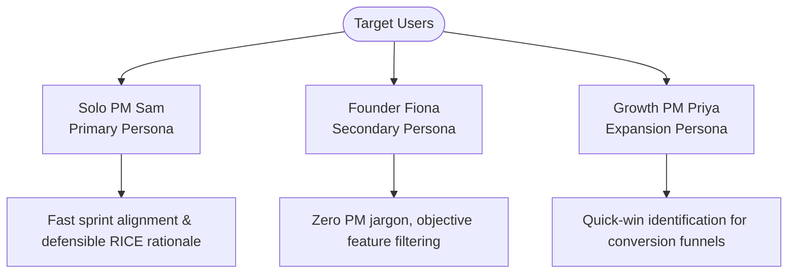
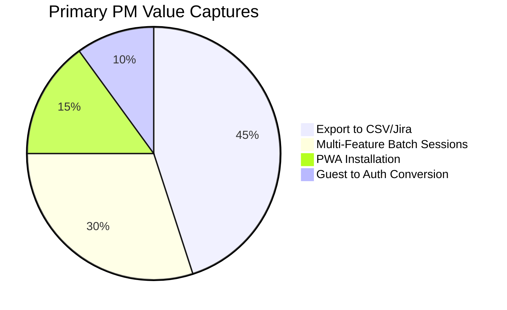

# PRD — PriorityAI (AI Feature Prioritization Dashboard) 🚀

> **Status:** Approved / Production Ready 🟢  
> **Author:** Bhushan Bhosale (Lead Product Manager)  
> **Target Release:** v1.0 MVP (Live on Vercel)  
> **Product URL:** [01-feature-prioritizer.vercel.app](https://01-feature-prioritizer.vercel.app)  
> **Last Updated:** August 2026  

---

## 1. Executive Summary

**PriorityAI** is an AI-native decision-intelligence dashboard built for Solo Product Managers and early-stage startup founders. It solves the chronic velocity bottleneck of manual backlog prioritization by automating the **RICE Scoring Framework** (Reach, Impact, Confidence, Effort) using Google Gemini LLMs.

Within 5 seconds of submitting unstructured feature descriptions, PriorityAI:
1. Calculates objective RICE scores with detailed AI-written rationale.
2. Plots features onto an interactive **2x2 Effort vs. Impact Matrix** (Quick Wins, Major Projects, Fill-ins, Thankless Tasks).
3. Synthesizes prioritized items into an automated **Now / Next / Later Sprint Roadmap** with 1-click CSV export.

By adopting a **Bring Your Own Key (BYOK)** architecture and Progressive Web App (PWA) distribution, PriorityAI operates with zero server inference overhead while delivering desktop-grade offline-first utility.

---

## 2. Problem Statement

### Who has this problem?
* **Primary:** Growth & Solo Product Managers in fast-moving Seed to Series A startups (10–50 employees).
* **Secondary:** Non-technical founders and Indie Hackers deciding product direction without dedicated product ops teams.

### What is the problem?
1. **Spreadsheet Manual Overhead:** PMs spend 2–4 hours every sprint manually configuring complex Google Sheets or Excel formulas, standardizing scoring scales, and manually plotting 2x2 charts.
2. **Subjective "HiPPO" Bias:** Backlog decisions frequently derail into endless debates driven by the *Highest Paid Person's Opinion (HiPPO)* or vocal sales requests rather than structured, defensible metrics.
3. **Tooling Bloat & Prohibitive Costs:** Incumbent enterprise product discovery tools (Productboard, Airfocus, Jira Product Discovery) cost $20–$100/seat/month, requiring weeks of onboarding that early-stage teams cannot justify.

### Why is it painful?
* **Sprint Velocity Loss:** 2+ hours wasted per weekly grooming session.
* **Engineering Capital Waste:** Building low-impact, high-effort features due to uncalibrated gut-feel prioritization.
* **Stakeholder Friction:** Lack of transparent, documented reasoning for why feature A beat feature B.

### Research & Market Evidence
* **70%** of early-stage PMs rely on ad-hoc spreadsheets that become stale within 3 sprints.
* **62%** of engineering leads cite "unclear prioritization logic" as the #1 source of friction with product managers.

---

## 3. Target Users & Personas



### Primary Persona: Solo PM Sam
* **Profile:** 28, Sole PM at a 20-person B2B SaaS startup.
* **Core Job-to-be-Done (JTBD):** "When preparing our bi-weekly sprint backlog, I want to quickly evaluate 10+ feature requests objectively, so that I can align engineers and founders without endless debates."
* **Frustrations:** Disorganized Notion backlogs; spending late Sunday nights wrestling with spreadsheet formulas.
* **Desired Outcome:** Instant, defensible scoring with structured rationale to present directly in sprint planning.

### Secondary Persona: Founder Fiona
* **Profile:** 34, Non-technical Founder building a zero-to-one consumer MVP.
* **Core Job-to-be-Done (JTBD):** "When flooded with user feedback and feature ideas, I want an AI advisor to filter what matters now vs. later, so that I don't waste my limited engineering budget."
* **Frustrations:** Intimidated by complex PM frameworks; vulnerable to the latest customer feedback bias.
* **Desired Outcome:** Clear visual separation between *Quick Wins* and *Thankless Tasks*.

---

## 4. Strategic Context & Why Now

1. **LLM Reasoning Breakthroughs:** LLMs (Google Gemini 1.5/Flash) can now analyze qualitative product descriptions and infer realistic Reach, Impact, Confidence, and Effort with granular justification.
2. **The Rise of the 1-Person Tech Company:** With AI code generation (Cursor, Antigravity, Bolt), execution speed is 10x faster. The primary bottleneck has shifted from *coding* to *product decision-making*.
3. **The BYOK Free-Tier Distribution Wedge:** By letting users supply their own Gemini API key, PriorityAI eliminates recurring AI inference costs, unlocking a permanently free, viral product wedge.

---

## 5. Feature Specifications & Requirements

### 5.1 System Architecture Overview

```mermaid
flowchart LR
    Client[Next.js PWA Client] -->|Feature Input| API[/api/prioritize]
    API -->|Prompt & Params| Gemini[Google Gemini 1.5 Flash]
    Gemini -->|Structured JSON| API
    API -->|RICE Scores + Rationale| Client
    Client --> Matrix[2x2 Interactive Matrix]
    Client --> Roadmap[Now/Next/Later Swimlanes]
    Client --> Export[CSV 1-Click Export]
    Client <-->|Workspace Sync| Firebase[(Firebase Auth & Firestore)]
```

### 5.2 User Stories & Acceptance Criteria

#### User Story 001: AI Feature RICE Estimation
* **As a** Solo PM Sam  
* **I want to** submit a feature name and description for automated AI RICE scoring  
* **So that** I receive Reach, Impact, Confidence, Effort values and written justification in seconds.

##### Acceptance Criteria (Given / When / Then):
* **Scenario 1: Successful Analysis with Gemini BYOK**
  * **Given** the user is on `/analyze` and has saved a valid Gemini API key in Settings,
  * **When** they enter a feature name, description, category, and click *"Analyze Feature"*,
  * **Then** the UI displays an animated skeleton loading state,
  * **And then** renders a RICE score card showing Reach (1–1000), Impact (0.5–3), Confidence (0–100%), Effort (1–5 person-months), Calculated Score `(R × I × C) / E`, and 2–3 sentences of AI reasoning within 6 seconds.
* **Scenario 2: Missing API Key**
  * **Given** the user has not configured an API key and the server fallback is exhausted,
  * **When** they click *"Analyze Feature"*,
  * **Then** a modal prompts them to add their free Google Gemini API key with a direct link to Google AI Studio.

---

#### User Story 002: Interactive 2x2 Effort vs. Impact Quadrant Matrix
* **As a** Founder Fiona  
* **I want to** view analyzed features plotted on a 2x2 Effort vs. Impact bubble chart  
* **So that** I can visually separate high-leverage *Quick Wins* from resource-draining *Thankless Tasks*.

##### Acceptance Criteria:
* **Given** at least 1 feature has been scored,
* **When** the user views the Matrix section on `/analyze`,
* **Then** features are plotted on an X-axis (Effort: 1 to 5) and Y-axis (Impact: 0.5 to 3),
* **And then** hover tooltips display feature name, category, and precise RICE rank,
* **And then** quadrant zones are visually demarcated:
  * Quadrant I: **Major Projects** (High Effort, High Impact)
  * Quadrant II: **Quick Wins** (Low Effort, High Impact) — *Highlighted*
  * Quadrant III: **Fill-ins** (Low Effort, Low Impact)
  * Quadrant IV: **Thankless Tasks** (High Effort, Low Impact) — *Warning Accent*

---

#### User Story 003: Automated Now / Next / Later Sprint Roadmap & CSV Export
* **As a** Solo PM Sam  
* **I want to** categorize prioritized features into sprint swimlanes and download them as a CSV  
* **So that** I can import them directly into Jira, Linear, or Google Sheets for sprint execution.

##### Acceptance Criteria:
* **Given** multiple scored features exist in the active workspace,
* **When** the user navigates to the Roadmap tab,
* **Then** top-ranked RICE features are allocated to **NOW** (Sprint 1), mid-ranked to **NEXT** (Sprint 2–3), and lower-ranked to **LATER** (Backlog/Icebox),
* **And when** the user clicks *"Export CSV"*,
* **Then** a formatted file `priorityai-export-[timestamp].csv` is downloaded containing headers: `Feature Name`, `Description`, `Category`, `Reach`, `Impact`, `Confidence`, `Effort`, `RICE Score`, `Quadrant`, `Timeline`, and `AI Reasoning`.

---

## 6. Non-Functional Requirements (NFRs)

| Dimension | Target Specification |
|---|---|
| **Performance / Latency** | AI scoring round-trip $\le 5.0$ seconds on 4G connections. First Contentful Paint (FCP) $\le 1.2$s. |
| **Security & Privacy** | BYOK API keys stored exclusively in browser `localStorage` / encrypted client state; never logged or persisted on backend servers. |
| **Availability & Reliability** | 99.9% uptime hosted on Vercel Edge Network with graceful degradation if LLM APIs throttle. |
| **Responsiveness & PWA** | Fully responsive from 360px (mobile) to 4K desktop; PWA install banner triggers on Web App Manifest standard. |
| **Browser Compatibility** | Chrome, Edge, Safari, Firefox (latest 2 versions); iOS Safari 16+, Android Chrome 110+. |

---

## 7. Success Metrics & KPIs



### North Star Metric
* **Actionable Roadmaps Created:** Number of sessions where $\ge 3$ features are scored and exported to CSV per week.

### Primary Metrics
* **Export Conversion Rate:** $\ge 25\%$ of sessions with analyzed features result in a CSV export.
* **Time-to-Value (TTV):** $\le 45$ seconds from landing page arrival to first feature RICE score generated.

### Secondary Metrics
* **PWA Install Rate:** $\ge 12\%$ of returning weekly users install the PWA.
* **User Retention (D7 / D30):** $30\%$ Day 7 return rate for weekly sprint grooming cycles.

---

## 8. Out of Scope (Explicit Anti-Goals for v1.0)

* ❌ **Full Jira/Linear Bi-directional Sync:** In v1.0, data export is handled via standard CSV format to prevent OAuth token management overhead. Bi-directional API webhooks scheduled for v1.1.
* ❌ **Multi-user Real-time Collaborative Cursor Voting:** Complex WebSocket CRDT multi-user editing deferred to v1.2.
* ❌ **Custom Prioritization Formulas (e.g., WSJF, Kano, MoSCoW custom weighting editor):** v1.0 focuses strictly on mastering the standard industry RICE framework.

---

## 9. Dependencies, Risks & Mitigations

| Risk / Dependency | Impact | Severity | Mitigation Strategy |
|---|---|---|---|
| **Gemini API Rate Limiting / Downtime** | Users receive scoring errors during peak hours | Medium | Built-in retry logic with exponential backoff; clear user feedback for BYOK key exhaustion. |
| **Hallucinated or Arbitrary RICE Estimates** | PM loses trust in AI-generated reasoning | High | Few-shot grounded prompting with strict scoring rubrics (Impact 0.5–3 scale, Effort in person-months) and mandatory rationale field. |
| **Local Storage Clear / Data Loss** | Guest users lose unsaved roadmaps | Medium | Optional 1-click Firebase Google Sign-In to sync workspaces across devices. |

---

## 10. Release & Rollout Plan

* **Phase 1 (Alpha / Dogfooding):** Internal testing with 5 PMs evaluating real sprint backlogs (Completed ✅).
* **Phase 2 (Public Beta):** Deployment on Vercel with BYOK support and PWA capabilities (Completed ✅).
* **Phase 3 (GTM Launch):** Product Hunt launch, LinkedIn PM community walkthroughs, and directory submission.
