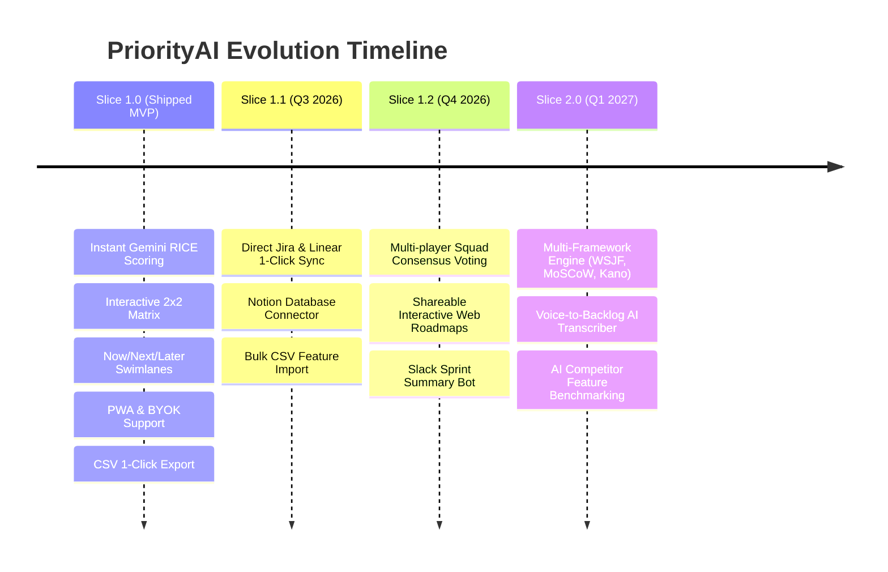
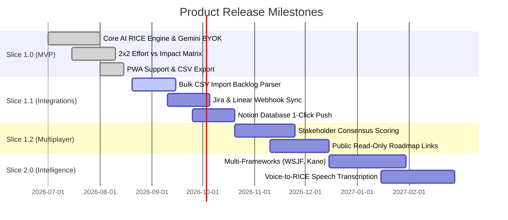
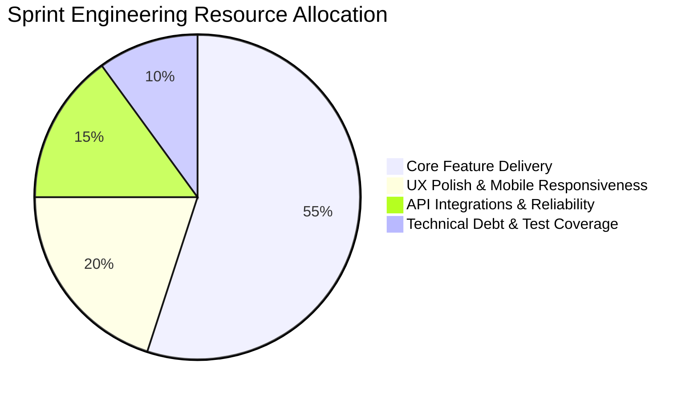

# Product Roadmap & Release Plan — PriorityAI 🗺️

> **Product:** PriorityAI (AI Feature Prioritization Dashboard)  
> **Author:** Bhushan Bhosale (Lead Product Manager)  
> **Planning Horizon:** Q3 2026 – Q1 2027  
> **Methodology:** Now / Next / Later & Value-Slice Release Framework  
> **Last Updated:** August 2026  

---

## 1. Product Vision & Strategic Themes

**Vision:** Empower every product builder and solo founder with an AI-native product discovery copilot that eliminates manual spreadsheet overhead and brings mathematical rigor to feature decisions.

---

## 2. Release Slices & Epic Breakdown

---

### 🟢 Slice 1.0 — MVP Core Foundation (Shipped & Live)
* **Objective:** Deliver instant time-to-value with automated RICE scoring and visual prioritization with zero server inference cost.
* **Key Features Delivered:**
  1. Automated AI RICE scoring engine (`/api/prioritize`) powered by Google Gemini.
  2. Granular AI written justification for Reach, Impact, Confidence, and Effort.
  3. Interactive 2x2 Effort vs. Impact bubble quadrant matrix with hover tooltips.
  4. Now / Next / Later sprint roadmap swimlanes.
  5. 1-Click CSV Export for Jira and Google Sheets.
  6. Client-side Bring Your Own Key (BYOK) privacy architecture.
  7. Installable Progressive Web App (PWA) with offline responsiveness.

---

### 🟡 Slice 1.1 — Ecosystem Integrations & Bulk Ingestion (Target: Q3 2026)
* **Objective:** Reduce data entry friction by allowing users to import existing backlogs and push prioritized features directly into active sprint trackers.
* **Epics:**
  * **Epic 1: Bulk CSV / Markdown Importer:** Drag and drop an existing backlog spreadsheet or text notes; AI automatically extracts feature titles, descriptions, and categories.
  * **Epic 2: 1-Click Jira & Linear Sync:** Direct OAuth connector to convert prioritized "NOW" items into Jira Epics/Stories or Linear issues with RICE scores attached as custom metadata.
  * **Epic 3: Notion Database Export:** Export structured databases directly into Notion with custom status tags and Effort-vs-Impact properties.

---

### 🔵 Slice 1.2 — Collaborative Multiplayer & Stakeholder Alignment (Target: Q4 2026)
* **Objective:** Turn prioritization from a solo exercise into a collaborative team ritual.
* **Epics:**
  * **Epic 1: Team Consensus Voting Index:** Enable developers, designers, and founders to anonymously vote on Effort and Impact sliders, generating a "Team Consensus Score" highlighting alignment gaps.
  * **Epic 2: Public Read-Only Shareable Roadmaps:** Generate a clean, branded link to share the 2x2 matrix and roadmap with external stakeholders or clients.
  * **Epic 3: Slack / Discord Sprint Summary Bot:** Post an automated Monday morning digest of prioritized Quick Wins directly to team communication channels.

---

### 🟣 Slice 2.0 — Multi-Framework & Advanced Intelligence (Target: Q1 2027)
* **Objective:** Expand beyond RICE to support any industry prioritization framework and natural multimodal inputs.
* **Epics:**
  * **Epic 1: Multi-Framework Engine:** Support for **WSJF** (Weighted Shortest Job First), **MoSCoW** (Must, Should, Could, Won't), **Kano Model**, and custom company weighting matrices.
  * **Epic 2: Voice-to-Backlog AI Copilot:** Record user interviews or team brainstorm audio; AI automatically extracts user stories and draft RICE scores.
  * **Epic 3: Competitor Benchmark Intel:** AI compares proposed features against competitor public changelogs to estimate market parity vs. differentiation value.

---

## 3. Engineering Capacity Allocation

---

## 4. Release Criteria & Quality Gates

Each release slice must pass four mandatory quality gates prior to production promotion:
1. **Performance:** P95 AI scoring round-trip $\le 5.0$ seconds on simulated 4G mobile connections.
2. **Data Integrity:** 100% of exported CSV files validate against standard Jira / Linear CSV import schemas.
3. **Security:** Zero client-side API key leakage in browser network logs or telemetry payloads.
4. **Usability:** System Usability Scale (SUS) score $\ge 85$ measured across 10 beta test sessions.
