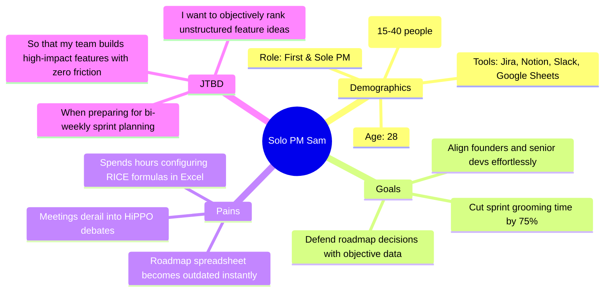
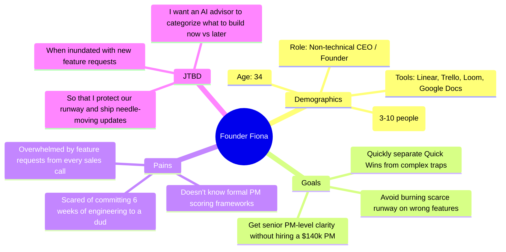
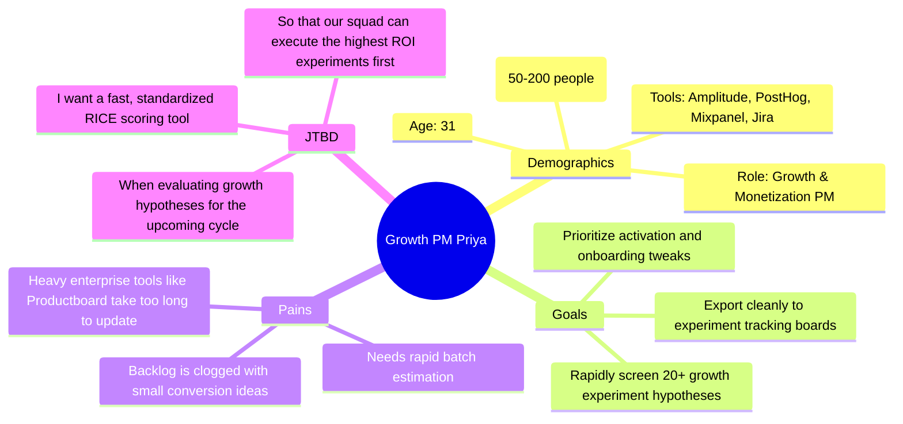
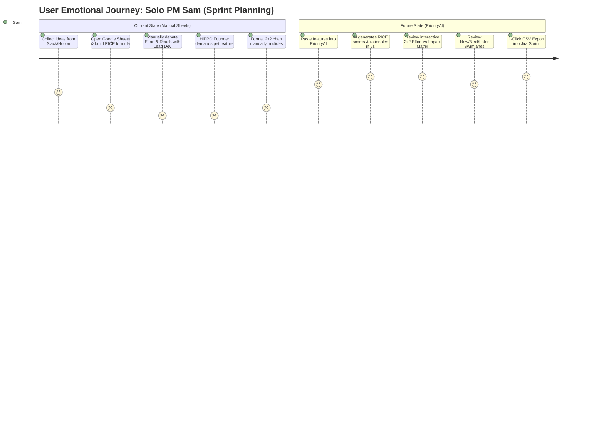

# User Personas & Customer Journey Maps — PriorityAI 👤

> **Product:** PriorityAI (AI-Powered Feature Prioritization Dashboard)  
> **Author:** Bhushan Bhosale (Lead Product Manager)  
> **Methodology:** Jobs-to-be-Done (JTBD) & User Journey Mapping  
> **Last Updated:** August 2026  

---

## 1. Deep User Personas

### 🥇 Primary Persona: Solo PM Sam

* **Quote:** *"I spend more time arguing about whether a button is high-effort than actually shipping features. I need an objective, math-backed baseline in seconds."*
* **Behavioral Traits:** Analytical, time-constrained, highly organized, values standardized frameworks (RICE, MoSCoW), constantly switching context between customer requests and developer constraints.
* **Key Objections:** "Will the AI produce believable scores, or generic hallucinations that our lead engineer will immediately dismiss?"

---

### 🥈 Secondary Persona: Founder Fiona

* **Quote:** *"Every customer asks for something different. I need a clear way to see which requests are quick wins versus massive traps before I tell our dev team."*
* **Behavioral Traits:** Visionary, fast-paced, intuitive, impatient with complex enterprise tooling, needs immediate visual clarity (2x2 matrix).

---

### 🥉 Expansion Persona: Growth PM Priya

* **Quote:** *"Growth is all about velocity. If it takes me 20 minutes to prioritize a single experiment idea in our legacy tool, we're moving too slowly."*

---

## 2. Customer Journey Map: Before vs. After PriorityAI

---

## 3. End-to-End Journey Map Matrix (Future State)

| Stage | User Goal | User Actions & Thoughts | Touchpoint / Screen | User Emotion | Opportunities for Delight |
|---|---|---|---|---|---|
| **1. Discovery & Arrival** | Understand what the tool does in $<10$ seconds | Lands on homepage; scans hero section; clicks *"Launch Prioritizer"*. | Landing Page Hero | 🤩 Intrigued | Vintage paperback aesthetic with live interactive teaser scorecards. |
| **2. Setup & Configuration** | Set up AI provider with zero billing friction | Opens Settings modal; enters free Google Gemini API key or uses demo session. | `SettingsModal.js` | 😌 Relieved | Clear step-by-step link to Google AI Studio for free instant API keys. |
| **3. Inputting Backlog** | Enter multiple feature ideas quickly | Enters feature names, short descriptions, and tags (e.g. Growth, Core, UX). | `/analyze` Input Card | ✍️ Focused | Pre-filled sample dataset buttons for 1-click test runs. |
| **4. AI RICE Generation** | Get objective, calculated scores & rationale | Clicks *"Analyze Feature"*; watches real-time progress skeleton. | AI Scoring Engine (`/api/prioritize`) | ⚡ Amazed | Granular AI rationale explaining *why* Reach is 500 and Effort is 2 months. |
| **5. Strategic Visualization** | Identify Quick Wins vs. Thankless Tasks | Interacts with 2x2 Effort vs. Impact bubble chart; hovers on quadrants. | 2x2 Matrix Component | 💡 Enlightened | Instant visual clarity—Quick Wins quadrant highlighted in crisp contrasting tones. |
| **6. Sprint Allocation & Export** | Organize into sprints and push to dev backlog | Checks Now / Next / Later lanes; clicks *"Export CSV"*. | Swimlanes & CSV Export | 🚀 Empowered | Auto-generated timestamped CSV ready for direct drag-and-drop into Jira / Linear. |
| **7. Retention & Revisit** | Re-open prior sessions for next sprint | Installs PWA to home screen; logs in via Google to sync workspace. | PWA Banner / Auth Menu | 🔒 Confident | Seamless offline PWA support and persistent multi-device syncing. |

---

## 4. Key Takeaways & Product Implications

1. **AI Rationale is the Moat:** Scores alone (e.g. "RICE = 750") are not enough; the PM needs the written *justification* to defend the score to engineering leads.
2. **Visual 2x2 is the Executive Selling Tool:** While PMs care about RICE numbers, Founders and Executives care about the visual 2x2 matrix to quickly sign off on decisions.
3. **Zero Friction Export is Mandatory:** The output must easily bridge back to Jira, Linear, or Notion; any platform lock-in will kill adoption.
